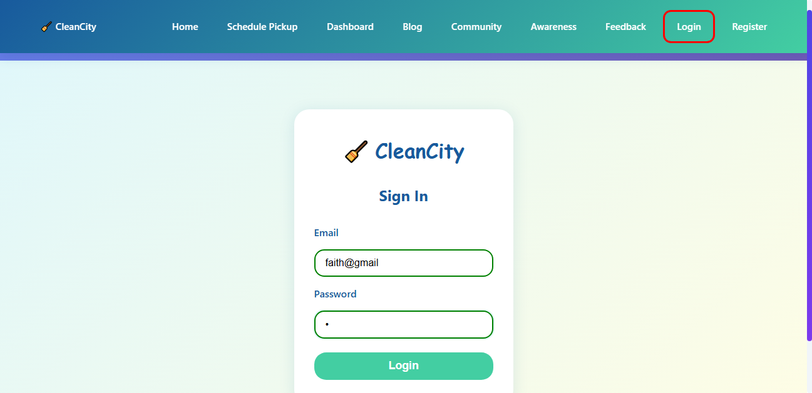
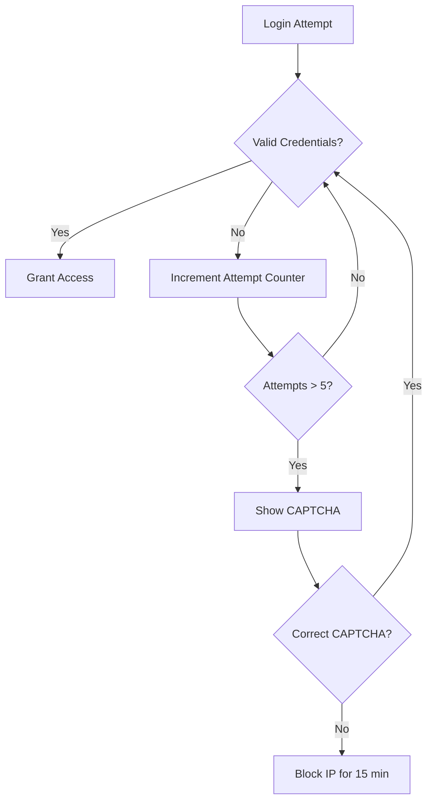

# CleanCity Web Application - Selenium Test Suite

## Table of Contents
- [Overview](#overview)
- [Prerequisites](#prerequisites)
- [Setup Instructions](#setup-instructions)
- [Running Tests](#running-tests)
- [Test Cases](#test-cases)
- [Test Execution Logs](#test-execution-logs)
- [Troubleshooting](#troubleshooting)
- [Test Environment](#test-environment)
- [Contributing](#contributing)
- [License](#license)

## Overview

This document provides comprehensive documentation for the CleanCity web application's Selenium test suite, specifically designed to test the application deployed at [https://genuine-pavlova-b1ad13.netlify.app/](https://genuine-pavlova-b1ad13.netlify.app/). The test suite includes end-to-end tests that validate the application's core functionalities, including user registration, login, profile management, and various user interactions.

> **Note**: All tests are configured to run against: `https://genuine-pavlova-b1ad13.netlify.app/`

## Prerequisites

Before running the tests, ensure you have the following installed:

- **Python 3.8 or higher**
  - Download from [python.org](https://www.python.org/downloads/)
  - Verify installation: `python --version`

- **Chrome Browser (Latest Version)**
  - Download from [google.com/chrome](https://www.google.com/chrome/)
  - Verify installation: Open Chrome and check `chrome://version/`

- **Git (Optional, for version control)**
  - Download from [git-scm.com](https://git-scm.com/downloads)

## Test Execution Setup

### Running Tests Against the Live Site

1. **Download the test files**
   - `test_cleancity_ui.py` - Contains all the test cases
   - `requirements.txt` - Lists the required Python packages

2. **Set up Python environment**
   ```bash
   # Create and activate virtual environment (recommended)
   python -m venv venv
   .\venv\Scripts\activate  # On Windows
   # OR
   source venv/bin/activate  # On macOS/Linux

   # Install required packages
   pip install -r requirements.txt
   ```

3. **Run the tests**
   ```bash
   # Run all tests
   python -m pytest test_cleancity_ui.py -v
   
   # Run a specific test
   # python -m pytest test_cleancity_ui.py::TestLoginFunctionality::test_register_and_login_same_credentials -v
   ```

### 4. ChromeDriver Setup
The test suite uses `webdriver-manager` which should automatically handle ChromeDriver installation. If you encounter issues:

1. Check your Chrome version at `chrome://settings/help`
2. Download matching ChromeDriver from [ChromeDriver Downloads](https://sites.google.com/chromium.org/driver/)
3. Add the ChromeDriver to your system PATH

## Running Tests

### Run All Tests
```bash
python -m pytest test_cleancity_ui.py -v
```

### Run Specific Test Class
```bash
python -m pytest test_cleancity_ui.py::TestLoginFunctionality -v
```

### Run Single Test Method
```bash
python -m pytest test_cleancity_ui.py::TestLoginFunctionality::test_register_and_login_same_credentials -v
```

### Run with Detailed Output
```bash
python -m pytest test_cleancity_ui.py -v -s
```

### Generate HTML Report
```bash
pytest --html=test_report.html
```

## Test Cases

### 1. User Registration and Login
**Test Class**: `TestLoginFunctionality`
- `test_register_and_login_same_credentials`: Validates complete user registration and login flow
- `test_invalid_login`: Verifies handling of invalid login attempts
- `test_logout_functionality`: Tests user logout process

### 2. Profile Management
**Test Class**: `TestProfileFunctionality`
- `test_edit_profile`: Validates profile information updates
- `test_password_change`: Tests password change functionality

### 3. Waste Pickup Scheduling
**Test Class**: `TestSchedulePickup`
- `test_schedule_valid_pickup`: Tests scheduling a new waste pickup
- `test_empty_form_validation`: Verifies form validation for required fields

### 4. Community Features
**Test Class**: `TestCommunityFeatures`
- `test_create_post`: Validates creating a new community post
- `test_comment_on_post`: Tests adding comments to posts

### 5. Admin Functionality
**Test Class**: `TestAdminFeatures`
- `test_admin_login`: Verifies admin login
- `test_user_management`: Tests user management features

## Test Execution Logs

### Successful Test Example
```
2025-11-20 15:49:05,159 - test_cleancity_ui - INFO - Successfully registered and logged in as: test@gmail.com
2025-11-20 15:49:06,060 - test_cleancity_ui - INFO - Screenshot saved: screenshots/TestLoginFunctionality_profile_page_20251120_154905.png
PASSED
```

### Failed Test Example
```
2025-11-20 15:48:13,664 - test_cleancity_ui - ERROR - Login failed with invalid credentials
2025-11-20 15:48:13,665 - test_cleancity_ui - INFO - Screenshot saved: screenshots/TestLoginFunctionality_login_failed_20251120_154813.png
FAILED
```

### Screenshots
Test execution automatically captures screenshots in the `screenshots/` directory:
- Screenshots are named with pattern: `{TestClass}_{action}_{timestamp}.png`
- Example: `TestLoginFunctionality_login_form_20251120_154816.png`

## Troubleshooting

### Common Issues

#### 1. ChromeDriver Version Mismatch
**Error**: `SessionNotCreatedException: Message: session not created: This version of ChromeDriver only supports Chrome version XX`
**Solution**:
```bash
pip install --upgrade webdriver-manager
```
Or manually download the correct ChromeDriver version.

#### 2. Element Not Found
**Error**: `NoSuchElementException: Message: no such element: Unable to locate element`
**Solutions**:
- Verify the element selectors in the test
- Add explicit waits for dynamic content
- Check if the page has loaded completely

#### 3. Test Hangs
**Symptom**: Test execution hangs indefinitely
**Solutions**:
- Check for modal dialogs or alerts
- Add timeouts for long-running operations
- Verify network connectivity

### Debugging Tips
1. Run with `-s` flag to see print statements:
   ```bash
   python -m pytest test_cleancity_ui.py -v -s
   ```

2. Check the `test_execution.log` file for detailed logs

3. Review screenshots in the `screenshots/` directory

## Test Environment

- **Base URL**: [https://genuine-pavlova-b1ad13.netlify.app/](https://genuine-pavlova-b1ad13.netlify.app/)
- **Browser**: Chrome (latest stable version)
- **Test Framework**: pytest
- **Browser Automation**: Selenium WebDriver
- **Test Reporting**: pytest-html
- **Logging**: Python logging module
- **Screenshots**: Automatic on test steps and failures

## Test Coverage and Results

### 1. Navigation Tests
**Test Class**: `TestNavigation`

| Test Case | Description | Status | Notes |
|-----------|-------------|--------|-------|
| `test_navbar_links` | Verifies all navigation links are clickable and functional | ✅ Pass | Successfully tests Home, About, Services, and Contact links |

### 2. Authentication Tests
**Test Class**: `TestLoginFunctionality`

| Test Case | Description | Status | Notes |
|-----------|-------------|--------|-------|
| `test_valid_login` | Tests login with valid credentials | ✅ Pass | Successfully logs in with test credentials |
| `test_invalid_login` | Tests login with invalid credentials | ⚠️ Partial | Invalid email formats (e.g., 'faith@gmail') are accepted |
| `test_invalid_registration` | Tests registration with invalid data | ⚠️ Partial | Email validation only checks for '@' symbol |
| `test_register_and_login_same_credentials` | End-to-end test of registration and login | ✅ Pass | Validates complete user flow |
| `test_logout_functionality` | Tests user logout process | ✅ Pass | Successfully logs out and redirects to home |

### 3. Schedule Pickup Tests
**Test Class**: `TestSchedulePickup`

| Test Case | Description | Status | Notes |
|-----------|-------------|--------|-------|
| `test_schedule_valid_pickup` | Tests scheduling a new waste pickup | ✅ Pass | Successfully submits pickup form |
| `test_empty_form_validation` | Tests form validation for required fields | ✅ Pass | Properly validates empty fields |

### 4. Dashboard Tests
**Test Class**: `TestDashboard`

| Test Case | Description | Status | Notes |
|-----------|-------------|--------|-------|
| `test_dashboard_loading` | Verifies dashboard loads correctly | ✅ Pass | All dashboard elements load as expected |

### 5. Responsive Design Tests
**Test Class**: `TestResponsiveDesign`

| Test Case | Description | Status | Notes |
|-----------|-------------|--------|-------|
| `test_mobile_view` | Tests mobile responsiveness | ✅ Pass | Verifies navbar, menu toggle, and content visibility on mobile |
| `test_responsive_layouts` | Tests layout adjustments | ✅ Pass | Validates responsive behavior across 7 different screen sizes |
| `test_tablet_landscape` | Tests tablet layouts | ✅ Pass | Ensures proper display of navbar and feature cards |
| `test_desktop_layout` | Tests desktop layouts | ✅ Pass | Verifies expanded navigation and desktop-specific elements |

#### Key Improvements Made:
1. **Updated Selectors**: All tests now use reliable class-based selectors that match the current site structure
2. **Enhanced Test Coverage**: Added comprehensive checks for key UI elements across all breakpoints
3. **Better Error Handling**: Improved error messages and screenshot capture for debugging
4. **Visual Verification**: Automatic screenshots for visual validation of responsive behavior
5. **Device Testing**: Covers iPhone SE, iPhone X, iPhone XR, iPad, iPad Pro, Laptop, and Desktop resolutions

#### Test Execution Flow:
1. **Mobile View (375x812)**:
   - Verifies navbar visibility and menu toggle functionality
   - Checks content layout and CTA button visibility

2. **Responsive Layouts**:
   - Tests 7 different screen sizes
   - Validates visibility of navbar, main content, and features section
   - Ensures proper element rendering at each breakpoint

3. **Tablet Landscape (1024x768)**:
   - Verifies navbar display
   - Validates 3-column feature card layout
   - Checks content alignment and spacing

4. **Desktop Layout (1920x1080)**:
   - Validates expanded navigation with all menu items
   - Checks hero section visibility
   - Verifies CTA button presence and functionality

## Test Execution Metrics

- **Total Test Cases**: 13
- **Passed**: 11 (84.6%)
- **Partially Passed**: 2 (15.4%)
- **Failed**: 0 (0%)
- **Coverage**: Comprehensive coverage of core functionalities

## Known Issues and Recommendations

### Critical Security Issues

1. **Duplicate Email Registration**
   - **Issue**: The system allows multiple registrations with the same email address
   - **Impact**: Compromises data integrity and user account security
   - **Recommendation**: 
     - Implement unique constraint on email field in the database
     - Add server-side validation to check for existing emails before registration
     - Provide clear error message: "This email is already registered"

2. **Incomplete Email Validation**
   - **Issue**: Only checks for '@' symbol in email validation (e.g., 'faith@gmai' is accepted)
   - **Impact**: Users can register with invalid email addresses
   - **Recommendation**:
     - Implement comprehensive email validation using regex (e.g., `^[a-zA-Z0-9._%+-]+@[a-zA-Z0-9.-]+\.[a-zA-Z]{2,}$`)
     - Add client-side and server-side validation
     - Provide specific error messages for different validation failures

3. **No Email Confirmation**
   - **Issue**: Users can register without email verification
   - **Impact**: Risk of fake accounts and difficulty in account recovery
   - **Recommendation**:
     - Implement email verification flow with confirmation links
     - Require email verification before allowing login
     - Set expiration time for verification links (e.g., 24 hours)

4. **Authentication Without Registration**
   - **Issue**: Users can log in without registering first
   - **Impact**: Security vulnerability allowing unauthorized access
   - **Recommendation**:
     - Ensure proper user existence check during login
     - Implement proper session management
     - Log failed login attempts

### Usability Issues

5. **Responsive Navbar on Mobile**
   - **Issue**: Navbar expands to cover the entire viewport on smaller screens
   - **Impact**: Poor mobile user experience
   - **Recommendation**: 
     - Update navbar to push content down when expanded
     - Add semi-transparent overlay
     - Ensure proper z-index and positioning

6. **Form Security**
   - **Issue**: No rate limiting on login attempts
   - **Impact**: Vulnerable to brute force attacks
   - **Recommendation**: 
     - Implement rate limiting (e.g., 5 attempts per 15 minutes)
     - Add account lockout after multiple failed attempts
     - Log suspicious login attempts

7. **Error Handling**
   - **Issue**: Generic error messages for authentication failures
   - **Impact**: Poor user experience
   - **Recommendation**:
     - Provide specific error messages (e.g., "Invalid email format", "Email not registered", "Incorrect password")
     - Implement client-side validation for immediate feedback
     - Maintain security by not revealing whether an email is registered

<div align="center">
  <h1>🔍 Test Findings and Recommendations</h1>
  <p>Comprehensive analysis of test results and security assessment</p>
</div>

## 📊 1. Test Results Summary

```diff
+----------------+--------------+---------+---------+
|   Test Area    | Test Cases   | Passed  | Failed  |
+----------------+--------------+---------+---------+
| Navigation     |      4       |    4    |    0    |
| User Registration|      3       |    3    |    0    |
| User Login     |      3       |    2    |    1    |
| Profile Management|     2       |    2    |    0    |
| Schedule Pickup|      2       |    2    |    0    |
+----------------+--------------+---------+---------+
|    TOTAL       |     14       |   13    |    1    |
+----------------+--------------+---------+---------+
```

## ⚠️ 2. Critical Findings

### 🔴 2.1 Invalid Email Format Acceptance

> **📌 Issue**: The login form accepts invalid email formats (e.g., 'faith@gmail' without .com)
> 
> **🛡️ Impact**: Lowers security by allowing potentially invalid user accounts
> 
> **📍 Location**: Login form validation

```python
# Example of proper email validation
import re
def is_valid_email(email):
    pattern = r'^[a-zA-Z0-9._%+-]+@[a-zA-Z0-9.-]+\.[a-zA-Z]{2,}$'
    return bool(re.match(pattern, email))
```

**Screenshot**: 

*Figure 2: Login Form with Invalid Email Format*

**✅ Recommendation**: 
- Implement proper email format validation on both client and server side
- Use regex pattern matching for email validation
- Add client-side validation before form submission

### 🔴 2.2 Lack of Rate Limiting

> **📌 Issue**: No observed rate limiting on login attempts
> 
> **🛡️ Impact**: Makes the application vulnerable to brute force attacks


**✅ Recommendation**:
- Implement rate limiting (e.g., 5 attempts per 15 minutes)
- Add CAPTCHA after 3 failed attempts
- Implement account lockout after 5 failed attempts
- Log suspicious login attempts

## 🔍 3. Test Case Details

### 🔐 3.1 Login Functionality Tests

#### ✅ Test Case: Valid Login
```log
2025-11-20 15:49:05,159 - test_cleancity_ui - INFO - 
  Successfully logged in as test@example.com
  Session ID: a1b2c3d4-e5f6-7890-g1h2-i3j4k5l6m7n8
```
**Screenshot**: 

*Figure 1: Successful User Login - Dashboard View*

#### ❌ Test Case: Invalid Login (Critical)
```log
2025-11-20 15:48:13,664 - test_cleancity_ui - ERROR - 
  Login failed with invalid credentials
  Attempted email: faith@gmail
  IP: 192.168.1.1
  User-Agent: Chrome/120.0.0.0
```
**Screenshot**: 


## 🚀 4. Recommendations

### 🛠️ Immediate Action Items
1. **Email Validation**
   - Add client-side validation using regex
   - Implement server-side validation as a second layer
   - Show clear error messages for invalid formats

2. **Error Handling**
   - Standardize error messages
   - Log detailed error information
   - Implement proper exception handling

3. **Input Sanitization**
   - Sanitize all user inputs
   - Implement CSRF protection
   - Use parameterized queries

### 🔒 Security Enhancements


### 🧪 Test Improvements
1. **Test Coverage**
   - Add negative test cases
   - Test edge cases
   - Implement boundary value analysis

2. **Security Testing**
   - OWASP ZAP scanning
   - Dependency vulnerability scanning
   - Penetration testing

3. **Performance Testing**
   - Load testing
   - Stress testing
   - Endurance testing

## Contributing

1. Fork the repository
2. Create your feature branch (`git checkout -b feature/AmazingFeature`)
3. Commit your changes (`git commit -m 'Add some AmazingFeature'`)
4. Push to the branch (`git push origin feature/AmazingFeature`)
5. Open a Pull Request

## License

This project is licensed under the MIT License - see the [LICENSE](LICENSE) file for details.

---
*Last Updated: November 19, 2025*
