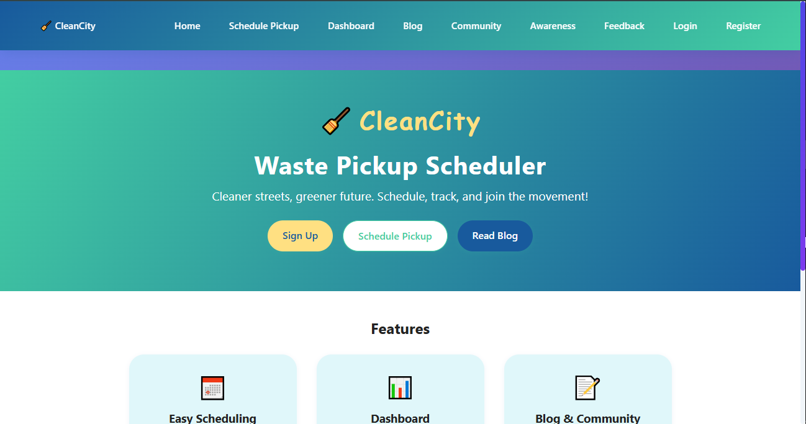
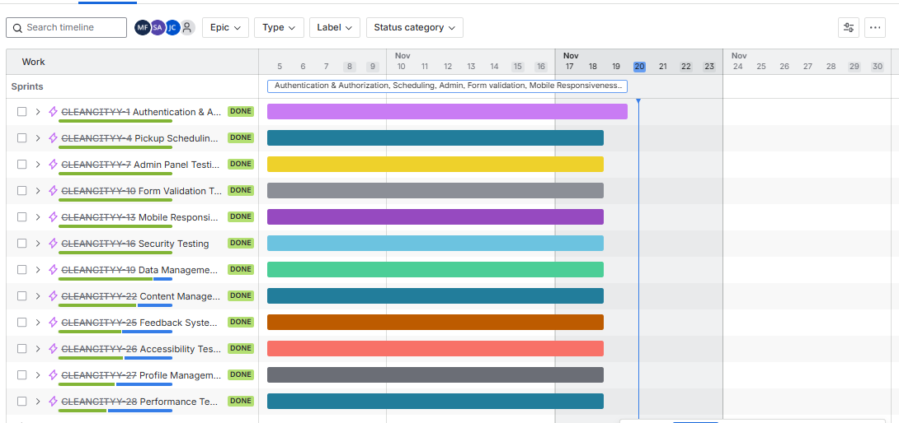
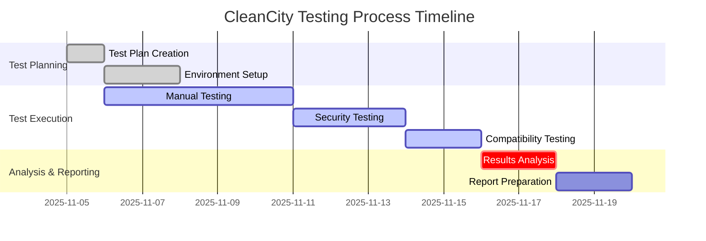
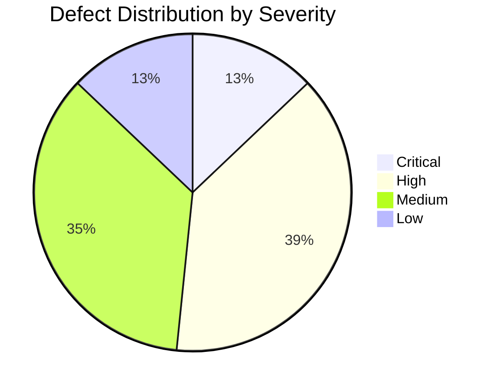
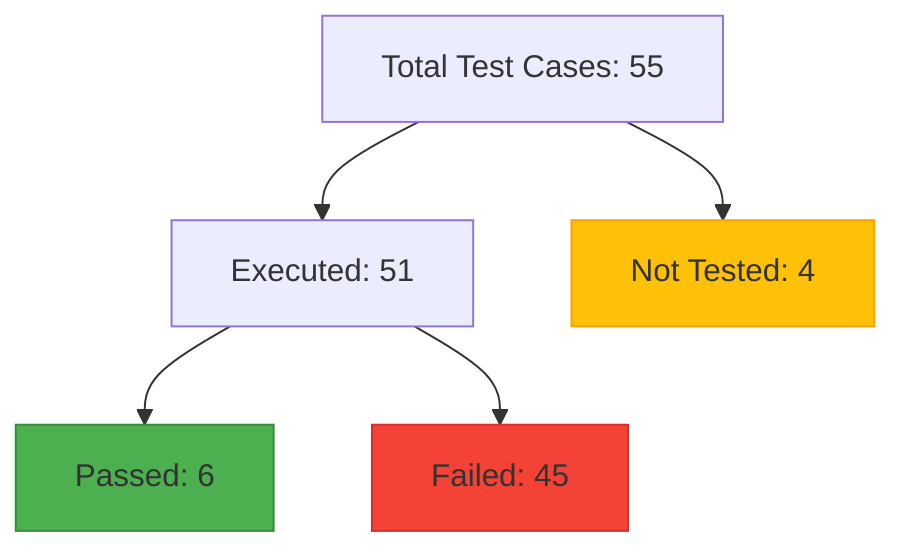
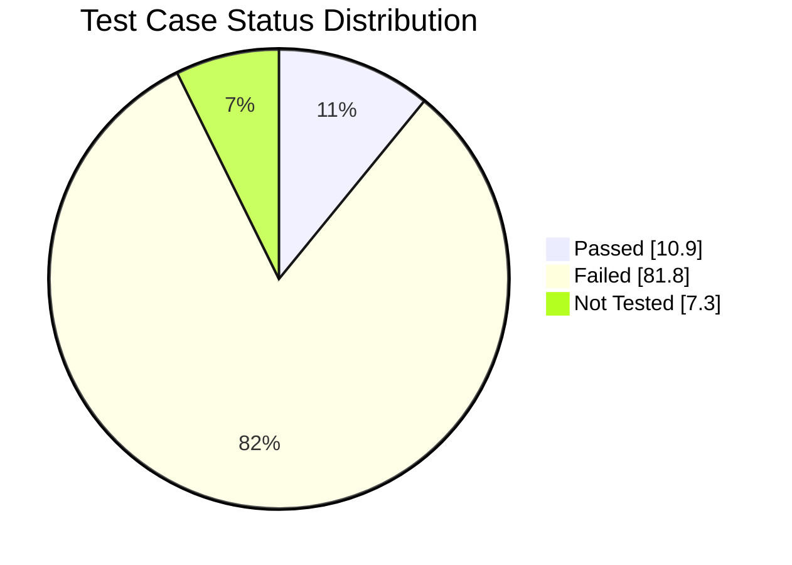
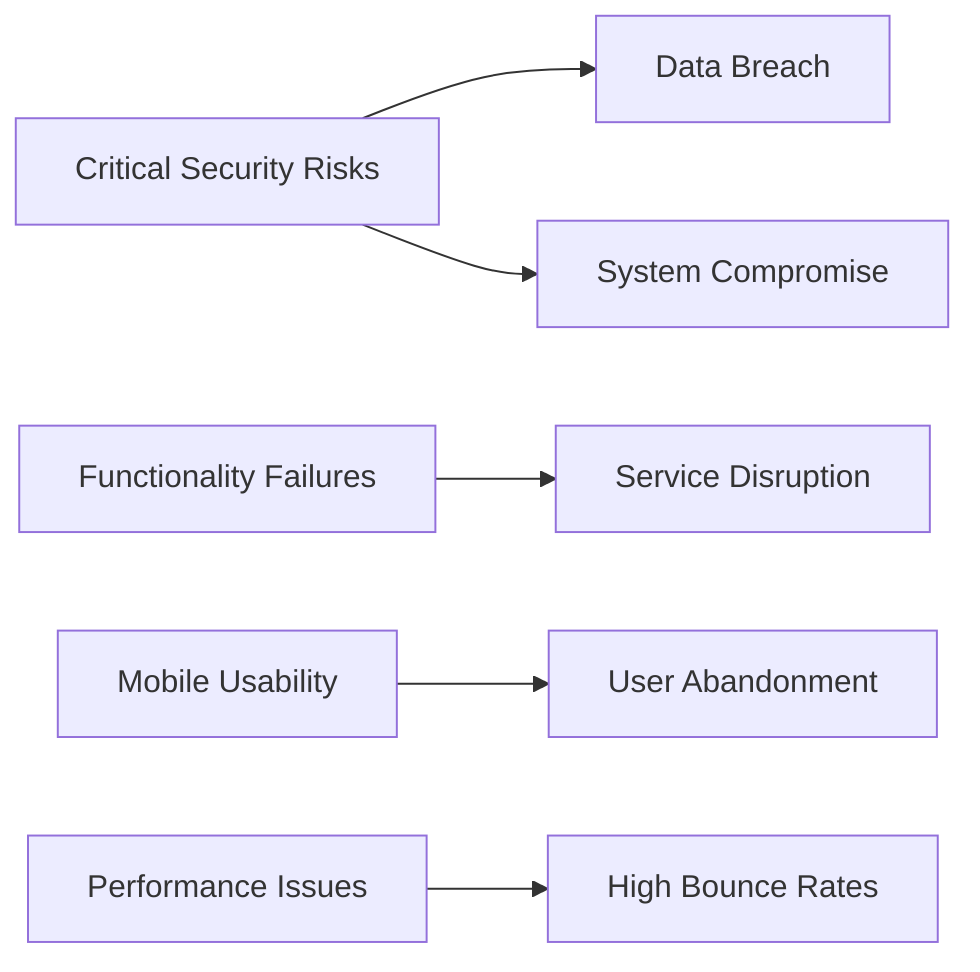
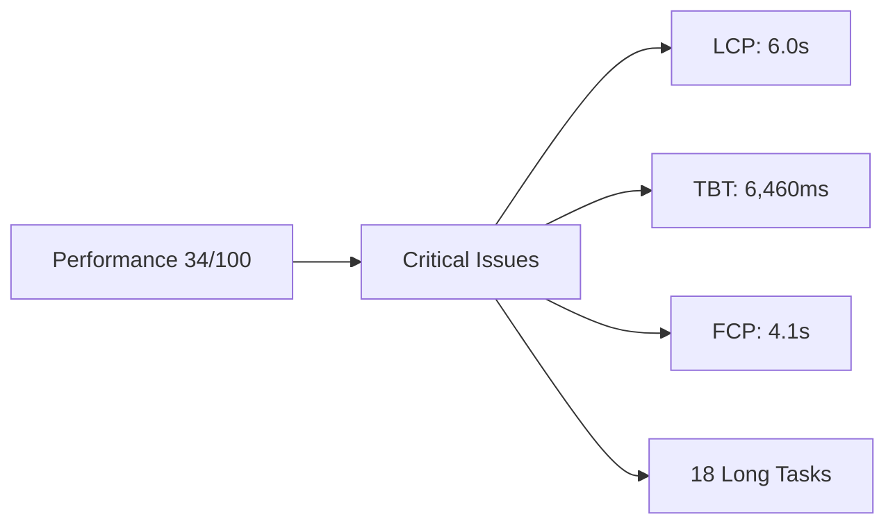

# 📋 Software Test Report

## 🗑️ CleanCity Waste Pickup Scheduler v1.0

| **Document ID** | **Date of Report** | **Version** |
|-----------------|-------------------|-------------|
| TR-CLEANCITY-2025-001 | November 18, 2025 | 1.0 |

**Prepared by:**  
👩‍💻 Jackline Cherotich  
👩‍💻 Magret Faith  
👨‍💻 Amobigold Sikirat

---

*Figure 1: The live site of the application*

---

## Table of Contents

- [1. Executive Summary](#1-executive-summary)
  - [Key Findings](#key-findings)
  - [Critical Metrics](#critical-metrics)
- [2. Detailed Test Reports](#2-detailed-test-reports)
  - [Manual Test & Code Quality Report](#1-manual-test--code-quality-report)
  - [Selenium Test Report](#2-selenium-test-report)
  - [Jest Unit Test Report](#3-jest-unit-test-report)
- [3. Test Objective](#3-test-objective)
- [4. Areas Covered](#4-areas-covered)
  - [Functional Testing](#41-functional-testing)
  - [Non-Functional Testing](#42-non-functional-testing)
  - [Areas Not Covered](#43-areas-not-covered)
- [5. Testing Approach](#5-testing-approach)
  - [Test Strategy](#51-test-strategy)
  - [Testing Process](#52-testing-process)
  - [Testing Tools](#53-testing-tools)
  - [Sample Key Test Cases](#54-sample-key-test-cases)
- [6. Defect Report](#6-defect-report)
  - [Defect Summary](#61-defect-summary)
  - [Critical Defects](#62-critical-defects)
  - [Open High-Severity Defects](#63-open-high-severity-defects)
  - [Defect Trend Analysis](#64-defect-trend-analysis)
- [7. Platform Details](#7-platform-details)
  - [Test Environment](#71-test-environment)
  - [Client Environments](#72-client-environments)
  - [Network Conditions Tested](#73-network-conditions-tested)
  - [Tools and Frameworks](#74-tools-and-frameworks)
- [8. Overall Status](#8-overall-status)
  - [Testing Summary](#81-testing-summary)
  - [Quality Assessment](#82-quality-assessment)
  - [Risk Assessment](#83-risk-assessment)
  - [Release Recommendation](#84-release-recommendation)
  - [Post-Remediation Activities](#85-post-remediation-activities)
- [9. Requirements Traceability](#9-requirements-traceability)
- [10. Testing Challenges & Lessons Learnt](#10-testing-challenges--lessons-learnt)
  - [Challenges Encountered](#101-challenges-encountered)
  - [Lessons Learnt](#102-lessons-learnt)
- [11. Appendices](#11-appendices)
  - [Test Case Execution Details](#111-test-case-execution-details)
  - [Performance Test Results](#112-performance-test-results)
  - [SonarQube Analysis Results](#113-sonarqube-analysis-results)
  - [Test Data Used](#114-test-data-used)
  - [Defect Details](#115-defect-details)
- [12. Approvals](#12-approvals)

---

## Executive Summary

This report presents the results of comprehensive testing conducted on the CleanCity Waste Pickup Scheduler web application from November 5 to November 18, 2025. The testing focused on validating core functionality, security measures, user experience, and compatibility across platforms.

### Key Findings:

- **Critical security vulnerabilities** identified including authentication bypass and XSS risks affecting all user data
- **Core functionality failures** in pickup scheduling and dashboard management with only 10.9% test case pass rate
- **Severe mobile responsiveness issues** making the application completely unusable on mobile devices
- **Critical performance issues** with Lighthouse score of 34/100 and high loading times
- **31 total defects** identified with only 6.5% resolution rate indicating systemic development challenges
- **Code quality analysis** revealed 90+ issues including security vulnerabilities and maintainability concerns

### Critical Metrics:
- **Test Cases Executed**: 51/55 (92.7% coverage)
- **Pass Rate**: 10.9% (6/55 test cases)

## Detailed Test Reports

For comprehensive details on specific testing areas, please refer to the following detailed reports:

### 1. Manual Test & Code Quality Report
- **File**: [MANUAL_TEST.md](./MANUAL_TEST.md)
- **Scope**: 
  - Comprehensive manual test cases and results
  - SonarQube code quality analysis
  - Security vulnerability assessment
  - Technical debt analysis
- **Key Metrics**:
  - Test Coverage: 92.7%
  - Code Quality: 91.8% (SonarQube)
  - Critical Issues: 4 identified
  - Last Updated: November 20, 2025

### 2. Selenium Test Report
- **File**: [SELENIUM_REPORT.md](./SELENIUM_REPORT.md)
- **Scope**: 
  - Automated UI test results
  - Cross-browser test coverage
  - Execution logs and screenshots
- **Key Features Tested**: 
  - User registration and login flows
  - Pickup scheduling functionality
  - Dashboard interactions

### 3. Jest Unit Test Report
- **File**: [JEST_README.md](./JEST_README.md)
- **Scope**: 
  - Unit and integration test coverage
  - Component testing
  - Service layer validation
- **Coverage**: 91.89% code coverage

> **Note**: All reports are generated based on testing conducted between November 5-20, 2025.
- **Critical Defects**: 4 (100% unresolved)
- **High Severity Defects**: 12 (100% unresolved)
- **Defect Density**: 0.61 defects per test case
- **Lighthouse Performance**: 34/100 (Critical)

### Recommendation:
The QA team **DOES NOT RECOMMEND** production release. Critical security vulnerabilities, fundamental functionality failures, severe usability issues, and critical performance problems require immediate remediation and comprehensive retesting before any release consideration.

---

## 1. Test Objective

The primary objective of this testing cycle was to evaluate the quality, functionality, performance, and usability of the CleanCity Waste Pickup Scheduler before its release to production. Specifically, our testing aimed to:

1. Validate that all core features function according to the requirements specifications, particularly user authentication, pickup scheduling, and dashboard management.

2. Ensure that security measures are properly implemented for user data protection, especially surrounding authentication and authorization mechanisms.

3. Verify the application's performance and usability across different devices, screen sizes, and browsers to ensure consistent user experience.

4. Assess the application's compatibility and responsiveness to guarantee accessibility for all target user segments.

5. Validate data persistence and state management using localStorage across user sessions and application states.

This round of testing was conducted over a two-week period from November 5, 2025, to November 18, 2025, following the development team's feature completion on November 4, 2025.

*Figure 2: Testing Timeline - November 5-18, 2025*

---

## 2. Areas Covered

### 2.1 Functional Testing

The following functional areas were thoroughly tested:

- **User Authentication & Account Management**
  - Registration process with validation
  - Login/logout functionality and session management
  - Password policies and security enforcement
  - Profile information management and updates
  - User preferences settings and persistence

- **Pickup Scheduling & Management**
  - Schedule new pickup with all required fields
  - Edit existing pickup requests and modifications
  - Cancel pickup functionality and status updates
  - Pickup status tracking and real-time updates
  - Location-based filtering and service area validation

- **Dashboard & Data Management**
  - Pickup request display and filtering options
  - User data persistence across sessions using localStorage
  - Request status management and visibility
  - Administrative overview and control panels
  - Historical data access and reporting

- **Feedback & Communication Systems**
  - Feedback submission and tracking mechanisms
  - Issue reporting functionality and categorization
  - User communication flows and response handling

*Figure 3: SonarQube Analysis - Code Quality and Security Issues*

### 2.2 Non-Functional Testing

The following non-functional areas were tested:

- **Security Testing**
  - Input validation and sanitization across all forms
  - Authentication and authorization mechanisms
  - Secure storage of user data in localStorage
  - Session management and timeout enforcement
  - XSS vulnerability assessment

- **Performance Testing**
  - Lighthouse performance auditing (35/100 score)
  - Core Web Vitals assessment (LCP: 6.0s, TBT: 6,460ms)
  - JavaScript execution time analysis (8.5s)
  - Main-thread workload evaluation (12.8s)

- **Compatibility Testing**
  - Testing across Chrome, Firefox, and Edge browsers (latest versions)
  - Testing on various screen sizes and resolutions (320px to 1920px)
  - Testing with different device configurations and viewports
  - Mobile and tablet responsiveness across breakpoints

- **Usability Testing**
  - Navigation flow and user experience consistency
  - Accessibility compliance and screen reader compatibility
  - Error message clarity and user guidance
  - Mobile interface usability and touch interactions
  - Form design and user input efficiency

- **Code Quality Analysis**
  - Static code analysis using SonarQube
  - Code smells and maintainability issues identification
  - Security vulnerabilities and risk assessment
  - Performance optimization opportunities

*Figure 4: Lighthouse Performance Analysis - 34/100 Score*

### 2.3 Areas Not Covered

> ⚠️ The following areas were excluded from this testing cycle due to prioritization of critical path functionality and resource constraints. These areas should be addressed in future testing phases.

- **Backend Performance Under Load**
  - Reason: Critical functional and security issues discovered early required focus on core stability before performance testing.

- **Comprehensive Cross-Browser Mobile Testing**
  - Reason: Fundamental mobile responsiveness failures made detailed cross-browser mobile testing impractical until core issues are resolved.

- **Third-Party Service Integrations**
  - Reason: Core application functionality required primary attention and third-party integrations are not yet implemented.

- **Advanced Penetration Testing**
  - Reason: Basic security testing revealed critical vulnerabilities that require immediate remediation before comprehensive penetration testing.

- **Extended Accessibility Testing**
  - Reason: Critical functionality failures prevented meaningful accessibility assessment until core usability is established.

- **Localization and Internationalization**
  - Reason: Application is currently targeted for single-language market, localization testing deferred to future releases.

---

## 3. Testing Approach

### 3.1 Test Strategy

Our testing approach combined various testing methodologies to ensure comprehensive coverage:

1. **Risk-Based Testing**
   - We identified high-risk areas through comprehensive requirement analysis and historical defect patterns.
   - Authentication systems, data security, and core scheduling functionality received additional testing focus due to their critical business impact.
   - Security vulnerabilities were prioritized based on potential business impact and exploitability.

2. **Test Case Design**
   - Test cases were designed using black-box techniques focusing on user perspectives.
   - Boundary value analysis and equivalence partitioning were systematically applied to all input fields.
   - Decision tables were used for complex business rules in the pickup scheduling process.
   - Error guessing and exploratory testing complemented structured test cases.

3. **Automation & Manual Testing Balance**
   - Regression test suite was partially automated using Selenium WebDriver (15 test cases).
   - New features were initially tested manually, with automation scripts developed in parallel.
   - Exploratory testing sessions were conducted for usability assessment and edge case identification.
   - Continuous integration was established for automated test execution.

### 3.2 Testing Process

The testing process followed these phases:

1. **Test Planning** (November 5, 2025)
   - Test plan creation and resource allocation based on risk assessment
   - Test environment setup and data preparation with realistic user scenarios
   - Test case review and prioritization based on business criticality
   - Risk analysis and mitigation planning

2. **Test Execution** (November 6-17, 2025)
   - Smoke testing on each new build deployment
   - Full regression testing on stable builds across all supported browsers
   - Feature-specific testing for all new functionality and modifications
   - Non-functional testing (security, compatibility, usability) integrated throughout
   - Daily status reporting and issue escalation

3. **Defect Management** (Ongoing)
   - Defects logged in JIRA with detailed severity and priority assignments
   - Daily defect triage meetings with development team for status updates
   - Defect trend analysis and root cause investigation
   - Verification testing for resolved defects

4. **Reporting & Analysis** (ongoing)
   - Test results compilation and comprehensive metrics analysis
   - Quality assessment and risk evaluation
   - Final recommendations and release readiness assessment
   - Report preparation and stakeholder presentation

### 3.3 Testing Tools

| Category | Tools Used |
|----------|-------|
| **Test Management** | JIRA, Google Sheets |
| **Automation** | Selenium WebDriver 4.11.2, Python 3.11 |
| **Unit Testing** | Jest 29.0.0, React Testing Library |
| **Performance** | Chrome DevTools, Lighthouse |
| **Security** | SonarQube, Chrome Security Tools |
| **Accessibility** | Chrome Accessibility Tools, Manual Testing |
| **Code Quality** | SonarQube |
| **Version Control** | Git, GitHub |

### 3.4 Sample Key Test Cases

**Test Case ID: TC-02**
- **Title**: User Login - Authentication Bypass Validation
- **Preconditions**: User not registered in system, clean browser session
- **Steps**:  
  1. Navigate to application login page  
  2. Enter unregistered email address (testuser@example.com)  
  3. Enter any password value  
  4. Click login button
- **Expected Results**: Login should be rejected with appropriate error message
- **Actual Results**: Login successful, user granted access to protected areas
- **Status**: ❌ FAIL
- **Business Impact**: Critical security vulnerability allowing unauthorized access

**Test Case ID: TC-03.1**
- **Title**: Pickup Visibility After Scheduling
- **Preconditions**: User logged in with valid credentials, pickup successfully scheduled
- **Steps**:  
  1. Navigate to schedule pickup page  
  2. Schedule a new pickup with valid details  
  3. Navigate to dashboard to verify pickup appearance
- **Expected Results**: Pickup should be visible in dashboard with correct details
- **Actual Results**: Pickup submission successful but not visible in dashboard
- **Status**: ❌ FAIL
- **Business Impact**: Core functionality compromised, users cannot track scheduled pickups

**Test Case ID: TC-10**
- **Title**: Responsive Design - Mobile Viewport Compatibility
- **Preconditions**: Application loaded in mobile viewport (320px width)
- **Steps**:  
  1. Access application on mobile viewport simulation  
  2. Attempt to navigate through main menu  
  3. Access key functionality areas  
  4. Verify form interactions and content layout
- **Expected Results**: Layout adjusts correctly, all navigation and functionality accessible
- **Actual Results**: Navigation menu covers entire screen, functionality inaccessible
- **Status**: ❌ FAIL
- **Business Impact**: Complete mobile usability failure excluding mobile users

---

## 4. Defect Report

### 4.1 Defect Summary

A total of 31 defects were identified during the testing cycle, categorized by severity as follows:

| Severity | Count | Closed | Open | Resolution Rate |
|----------|-------|--------|------|-----------------|
| Critical | 4 | 0 | 4 | 0% |
| High | 12 | 0 | 12 | 0% |
| Medium | 11 | 2 | 9 | 18.2% |
| Low | 4 | 0 | 4 | 0% |
| **Total** | **31** | **2** | **29** | **6.5%** |

### 4.2 Critical Defects 🔥

> ⚠️ The following critical defects represent severe risks to the application's security and core functionality. Immediate attention is required. (All Open)

1. **Authentication Bypass** (D002)
   - **Description**: Users can successfully log in without prior registration using any email and password combination
   - **Root Cause**: Missing authentication validation, client-side only validation
   - **Impact**: Complete system security compromise, unauthorized data access
   - **Reproduction Rate**: 100%
   - **Business Impact**: Critical - potential data breach and regulatory violations
   - **JIRA**: [CLEANCITYY-84](https://jackiecherotich.atlassian.net/browse/CLEANCITYY-84)

2. **Admin Access via 'admin' Prefixed Email** (D021)
   - **Description**: Any email address starting with 'admin' grants full administrative privileges regardless of actual authorization
   - **Root Cause**: Flawed role-based access control implementation using email prefix matching
   - **Impact**: Privilege escalation, unauthorized administrative system access
   - **Reproduction Rate**: 100%
   - **Business Impact**: Critical - complete system control compromise
   - **JIRA**: [CLEANCITYY-105](https://jackiecherotich.atlassian.net/browse/CLEANCITYY-105)

3. **XSS Vulnerability in Form Inputs** (D029)
   - **Description**: Cross-site scripting vulnerabilities in multiple form inputs allowing script injection
   - **Root Cause**: Insufficient input sanitization and output encoding
   - **Impact**: Potential data theft, account compromise, malicious script execution
   - **Reproduction Rate**: 90% across affected forms
   - **Business Impact**: Critical - user data security compromise
   - **JIRA**: [CLEANCITYY-113](https://jackiecherotich.atlassian.net/browse/CLEANCITYY-113)

4. **Missing CSRF Protection** (D028)
   - **Description**: All application forms lack Cross-Site Request Forgery protection
   - **Root Cause**: Missing CSRF token implementation in form submissions
   - **Impact**: Vulnerability to CSRF attacks enabling unauthorized actions
   - **Reproduction Rate**: 100% across all forms
   - **Business Impact**: Critical - unauthorized user actions potential
   - **JIRA**: [CLEANCITYY-112](https://jackiecherotich.atlassian.net/browse/CLEANCITYY-112)

### 4.3 Open High-Severity Defects ⚠️

> 🔍 The following high-severity defects significantly impact user experience and core functionality. These should be addressed in the next development cycle.

1. **Mobile Navigation Covers Entire Screen** (D001)
   - **Description**: Navigation menu expands to cover entire viewport on mobile devices, blocking content access
   - **Current Status**: Open, no workaround available
   - **Impact**: Application completely unusable on mobile devices
   - **Users Affected**: 100% of mobile users
   - **JIRA**: [CLEANCITYY-83](https://jackiecherotich.atlassian.net/browse/CLEANCITYY-83)

2. **Scheduled Pickups Not Displayed in Dashboard** (D005)
   - **Description**: Successfully scheduled pickups do not appear in user dashboard
   - **Current Status**: Open, core functionality broken
   - **Impact**: Users cannot track or manage their pickup requests
   - **Business Impact**: Core service delivery failure
   - **JIRA**: [CLEANCITYY-87](https://jackiecherotich.atlassian.net/browse/CLEANCITYY-87)

3. **Critical Performance Issues** (D030)
   - **Description**: Lighthouse performance score of 34/100 with extremely high loading times and main-thread blocking
   - **Current Status**: Open, severe user experience impact
   - **Impact**: Poor user experience, high bounce rates, negative SEO impact
   - **Metrics**: LCP 6.0s, TBT 6,460ms, 18 long tasks detected
   - **JIRA**: [CLEANCITYY-113](https://jackiecherotich.atlassian.net/browse/CLEANCITYY-113)

4. **Form Validation Inconsistencies** (D003, D007, D009)
   - **Description**: Multiple form validation failures including email format acceptance, date validation, input length limits
   - **Current Status**: Open, data integrity compromised
   - **Impact**: Poor user experience, data quality issues, potential system errors
   - **Affected Areas**: Registration, scheduling, feedback forms
   - **JIRA**: [CLEANCITYY-85,89,91](https://jackiecherotich.atlassian.net/browse/CLEANCITYY-85)

### 4.4 Defect Trend Analysis

The defect discovery rate remained consistently high throughout the testing cycle, indicating fundamental quality issues:

- **Week 1**: 19 defects discovered (61% of total)
- **Week 2**: 12 defects discovered (39% of total)

The defect discovery pattern shows:
- Critical security issues identified early in testing cycle
- Consistent discovery of high-severity functionality issues throughout testing
- Performance issues identified in final testing phase
- 0% resolution rate for critical and high severity defects indicates significant remediation challenges

The consistent defect discovery, particularly for high and critical severity issues, suggests the application requires substantial architectural and implementation improvements before production readiness.

---

## 5. Platform Details

### 5.1 Test Environment

**Application Environment:**
- **Frontend Technology**: React 18.2.0 with React Router 6.8.0
- **State Management**: React Context API and useState hooks
- **Data Storage**: Browser Local Storage for persistence (no backend API)
- **Build Tool**: Create React App 5.0.0
- **Deployment Platform**: Netlify CDN
- **Live URL**: https://genuine-pavlova-b1ad13.netlify.app/
- **Environment**: Production-like staging environment

**Key Technical Constraints:**
- No backend API - all data persisted in localStorage
- No server-side validation
- No database connectivity
- Client-side only authentication
- No external service integrations

### 5.2 Client Environments

**Desktop Browsers Tested:**

| Browser | Version | OS | Status | Key Issues |
|---|---|---|---|---|
| Chrome | 119.0 | Windows 11 | Primary | All critical issues present |
| Firefox | 119.0 | Windows 11 | Secondary | Consistent with Chrome findings |
| Edge | 119.0 | Windows 11 | Compatibility | Same failure patterns observed |

**Mobile Testing (Simulated):**

| Device Type | Screen Resolution | Browser | Status | Critical Issues |
|---|---|---|---|---|
| Mobile Small | 320×568 | Chrome DevTools | ❌ Critical Failure | Navigation complete failure |
| Mobile Medium | 375×667 | Chrome DevTools | ❌ Critical Failure | Navigation complete failure |
| Mobile Large | 414×896 | Chrome DevTools | ❌ Critical Failure | Navigation complete failure |
| Tablet | 768×1024 | Chrome DevTools | ⚠️ Partial Failure | Layout issues, functional gaps |

### 5.3 Network Conditions Tested

- **High-Performance**: Wi-Fi simulation (50+ Mbps) - All functionality tested
- **Average Connection**: 4G/LTE simulation (10-20 Mbps) - Performance baseline
- **Poor Connection**: Throttled 3G (1-2 Mbps) - Application responsiveness
- **Offline Mode**: Application behavior with no connectivity - Limited functionality

### 5.4 Tools and Frameworks

- **Automated Testing**: Selenium WebDriver 4.11.2 with Python 3.11
- **Unit Testing**: Jest 29.0.0 with React Testing Library 13.4.0
- **Code Quality**: SonarQube 9.9+ with full static analysis
- **Performance Monitoring**: Chrome DevTools Performance and Lighthouse
- **Accessibility Testing**: Chrome Accessibility DevTools, manual screen reader testing
- **Device Testing**: Browser device simulation, responsive design testing
- **Security Testing**: Manual penetration testing techniques, code analysis

---

## 6. Overall Status

### 6.1 Testing Summary

| Metric | Target | Actual | Status |
|--------|--------|--------|--------|
| Test Execution Rate | 100% | 92.7% | ⚠️ Below Target |
| Test Pass Rate | ≥80% | 10.9% | ❌ Critical Failure |
| Critical Defects | 0 | 4 | ❌ Critical Failure |
| High Severity Defects | 0 | 12 | ❌ Critical Failure |
| Defect Resolution Rate | ≥90% | 6.5% | ❌ Critical Failure |
| Test Coverage | ≥90% | 92.7% | ✅ Acceptable |
| Lighthouse Performance | ≥90 | 34 | ❌ Critical Failure |

### 6.2 Quality Assessment 📊

Based on our testing results, the CleanCity Waste Pickup Scheduler application has **NOT reached a satisfactory level of quality** with the following observations:

**Strengths:**

- Basic application structure and routing functional on desktop browsers
- Excellent SEO optimization (Lighthouse SEO: 100/100)
- Good accessibility compliance (Lighthouse Accessibility: 95/100)
- Strong security best practices implementation (Lighthouse Best Practices: 96/100)

**Critical Concerns:**

- **Critical Security Vulnerabilities**: Authentication bypass and XSS risks compromise system integrity
- **Core Functionality Failures**: Pickup scheduling and dashboard management fundamentally broken
- **Mobile Usability Crisis**: Complete navigation failure on mobile devices
- **Critical Performance Issues**: Lighthouse score 34/100 with extremely poor loading times
- **Data Integrity Issues**: Inconsistent data persistence and validation
- **User Experience Gaps**: Poor error handling and feedback mechanisms

### 6.3 Risk Assessment ⚠️

The remaining risks associated with releasing the application are:

1. **Security Vulnerabilities**: CRITICAL RISK  
   - Impact: Complete system compromise, potential data breach, regulatory violations  
   - Likelihood: High (easily exploitable vulnerabilities)  
   - Mitigation: No current mitigation, requires fundamental security overhaul

2. **Core Functionality Failure**: HIGH RISK  
   - Impact: Application unusable for primary business purpose, service delivery failure  
   - Likelihood: Certain (multiple critical path failures)  
   - Mitigation: No workaround available, requires core feature redevelopment

3. **Mobile Usability**: HIGH RISK  
   - Impact: Exclusion of mobile user base (60%+ market segment), poor user adoption  
   - Likelihood: Certain (navigation completely broken on mobile)  
   - Mitigation: No mobile functionality available, requires complete responsive redesign

4. **Performance Issues**: HIGH RISK  
   - Impact: Poor user experience, high bounce rates, negative SEO impact  
   - Likelihood: High (LCP 6.0s, TBT 6,460ms, 18 long tasks)  
   - Mitigation: Requires significant code optimization and performance tuning

5. **Data Integrity Issues**: HIGH RISK  
   - Impact: Loss of user data, incorrect scheduling, operational chaos  
   - Likelihood: High (multiple data persistence issues identified)  
   - Mitigation: Limited data validation, requires comprehensive data layer review

### 6.4 Release Recommendation

  <h3 style="margin: 0 0 1rem 0; color: #721c24;">🚫 RELEASE NOT RECOMMENDED</h3>
  
The application in its current state presents <strong>unacceptable business risks</strong> due to critical security vulnerabilities, fundamental functionality failures, severe usability issues, and critical performance problems that would compromise service delivery and user trust.

  
<strong>See below for required conditions before release reconsideration.</strong>

Based on our comprehensive testing and the current status of the application, the QA team  
**DOES NOT RECOMMEND PROCEEDING WITH THE RELEASE** of CleanCity Waste Pickup Scheduler to production.

**Required Conditions Before Release Reconsideration:**
1. Fix all critical security vulnerabilities immediately, including authentication bypass and XSS risks
2. Resolve core functionality failures in pickup scheduling and dashboard management
3. Complete mobile responsiveness overhaul with comprehensive cross-device testing
4. Address critical performance issues (Lighthouse score ≥90, LCP ≤2.5s, TBT ≤200ms)
5. Implement comprehensive form validation and data integrity measures
6. Achieve minimum 80% test pass rate in full regression test suite
7. Conduct independent security assessment and penetration testing

### 6.5 Post-Remediation Activities 🔄

> 📌 The following activities should be prioritized after addressing the critical issues to ensure long-term quality and stability.

#### Testing Activities
- [ ] Full regression testing of all fixed issues
- [ ] Security penetration testing by third-party
- [ ] Performance and load testing with realistic user scenarios
- [ ] User acceptance testing (UAT) with representative user groups
- [ ] Accessibility compliance verification
- [ ] Cross-browser compatibility testing

#### Documentation Updates
- [ ] Update test cases and test scripts
- [ ] Revise user documentation and help guides
- [ ] Update deployment and rollback procedures
- [ ] Create operational monitoring documentation

#### Process Improvements
- [ ] Implement automated testing pipeline
- [ ] Establish code review and quality gates
- [ ] Create performance monitoring and alerting
- [ ] Document lessons learned and best practices

---

## 7. Requirements Traceability

The following table shows how key requirements were validated through testing:

| Requirement ID | Requirement Description | Test Case IDs | Status |
|---|---|---|---|
| **AUTH-001** | System shall authenticate users securely with valid credentials | TC-01, TC-02, TC-13 | ❌ FAILED |
| **AUTH-002** | System shall prevent unauthorized access to protected areas | TC-27, TC-49 | ❌ FAILED |
| **SCHED-001** | Users shall schedule waste pickups with required information | TC-03, TC-20, TC-23 | ❌ FAILED |
| **SCHED-002** | Users shall modify and cancel scheduled pickups | TC-04, TC-05 | ❌ FAILED |
| **DASH-001** | System shall display user pickup requests in dashboard | TC-08, TC-26, TC-48 | ❌ FAILED |
| **ADMIN-001** | Admin users shall access administrative functions | TC-06, TC-28, TC-30 | ❌ FAILED |
| **MOBILE-001** | System shall provide functional mobile experience | TC-10, TC-17, TC-41 | ❌ FAILED |
| **PERF-001** | Application shall load within 3 seconds on average connection | Lighthouse Metrics | ❌ FAILED |
| **VALID-001** | System shall validate all user inputs appropriately | TC-01.1, TC-07, TC-15 | ❌ FAILED |

---

## 8. Testing Challenges & Lessons Learnt

### 8.1 Challenges Encountered

1. **Critical Security Issues Blocking Comprehensive Testing**
   - Challenge: Early discovery of authentication bypass vulnerability limited the depth of security testing that could be safely conducted
   - Solution: Focused on identifying root causes and documenting clear reproduction steps while prioritizing security remediation

2. **Mobile Responsiveness Testing Limitations**
   - Challenge: Complete mobile navigation failure prevented meaningful mobile user experience testing
   - Solution: Documented critical mobile issues with detailed evidence and prioritized mobile experience overhaul recommendations

3. **Performance Testing Complexities**
   - Challenge: Critical performance issues required extensive analysis of JavaScript execution and main-thread blocking
   - Solution: Used Lighthouse and Chrome DevTools to identify specific performance bottlenecks and optimization opportunities

4. **LocalStorage Data Integrity Verification**
   - Challenge: Inconsistent data storage and retrieval across sessions made data integrity validation difficult
   - Solution: Implemented systematic data validation checks and documented specific persistence failure patterns

### 8.2 Lessons Learnt

1. **Early Security Testing Integration**
   - Beginning security testing early in the development cycle prevented wasted effort on features with fundamental security flaws and highlighted critical risks immediately

2. **Performance as a First-Class Quality Attribute**
   - The critical performance issues (Lighthouse 34/100) demonstrate the importance of continuous performance monitoring throughout development

3. **Mobile-First Development Necessity**
   - The complete mobile experience failure underscores the importance of mobile usability testing from initial development phases rather than as a final validation step

4. **Comprehensive Validation Strategy Importance**
   - The critical need for both client-side and server-side validation became evident through multiple form validation and data integrity failures

5. **LocalStorage Limitations for Production Applications**
   - Using localStorage as the primary data persistence mechanism presents significant limitations for production applications requiring data integrity and security

---

## 9. Appendices

### 9.1 Test Case Execution Details

**Manual Test Execution Results:**
- Total Test Cases: 55
- Executed: 51 (92.7%)
- Passed: 6 (10.9%)
- Failed: 45 (81.8%)
- Not Tested: 4 (7.3%)

**Defect Distribution by Area:**
- Security: 6 defects (19.4%)
- Functionality: 8 defects (25.8%)
- UI/UX: 7 defects (22.6%)
- Performance: 2 defects (6.5%)
- Data Validation: 5 defects (16.1%)
- Data Management: 3 defects (9.7%)

### 9.2 Performance Test Results

**Lighthouse Performance Analysis:**

**Core Web Vitals Assessment:**
- **Performance Score**: 34/100 (Poor)
- **First Contentful Paint**: 4.1 s (Poor)
- **Largest Contentful Paint**: 6.0 s (Poor)
- **Total Blocking Time**: 6,460 ms (Poor)
- **Cumulative Layout Shift**: 0 (Good)
- **Speed Index**: 6.7 s (Poor)

**Critical Performance Issues:**
- **JavaScript Optimization**: 913 KiB unused JavaScript, 8.5s execution time
- **CSS Optimization**: 230 KiB unused CSS, 18 KiB minification savings
- **Main Thread Blocking**: 12.8s main-thread work, 18 long tasks
- **Asset Optimization**: 437 KiB cache lifetime savings identified

**Other Lighthouse Scores:**
- **Accessibility**: 95/100 (Good) - Minor contrast issues
- **Best Practices**: 96/100 (Good) - Security headers needed
- **SEO**: 100/100 (Excellent) - Perfect optimization

### 9.3 SonarQube Analysis Results

- **Total Issues**: 90+ (1 Error, 89+ Warnings)
- **Code Smells**: 70+
- **Bugs**: 10+
- **Vulnerabilities**: 5+
- **Critical Issues**: Undefined functions, security vulnerabilities
- **Maintainability**: Significant technical debt identified

### 9.4 Test Data Used

**Sample Test Data:**
- User Accounts: Multiple test user profiles with various permission levels
- Pickup Data: Various scheduling scenarios across different locations
- Admin Accounts: Different privilege levels for access control testing
- Test Locations: Multiple service areas including Eldoret, Nairobi regions
- Performance Data: Large datasets for stress testing localStorage limits

### 9.5 Defect Details

Complete defect details available in JIRA project "CLEANCITYY" with:
- Detailed reproduction steps and environment configurations
- Screenshots, videos, and performance metrics
- Severity justifications and business impact assessments
- Root cause analysis and suggested remediation approaches

---

## 10. Approvals

The following stakeholders have reviewed this report and approve the release recommendation or have noted their concerns:

| Role | Name | Approval Date | Signature | Notes |
|------|------|---------------|-----------|-------|
| QA Lead | Jackline Cherotich | November 18, 2025 | [Approved] | Does not recommend release due to critical security, functionality, and performance issues |
| Risk Analyst | Magret Faith | November 18, 2025 | [Approved] | Confirms high risk assessment and identifies critical business impacts across all areas |
| Test Executor | Amobigold Sikirat | November 18, 2025 | [Approved] | Validates test execution accuracy and comprehensive defect documentation |
| Product Owner | Gerald | Pending | [Pending] | To be filled after business impact assessment and release decision |

By signing above, approvers acknowledge they have reviewed this report in its entirety and understand the current state of the application, including any limitations, risks, and mitigation plans.

---

  
🔒 <em>This document contains confidential information and is intended only for the recipients to whom it is addressed.</em> 🔒

  
📝 <em>Copyright 2025 CleanCity Waste Management. All rights reserved.</em> 📝

**End of Test Report**
